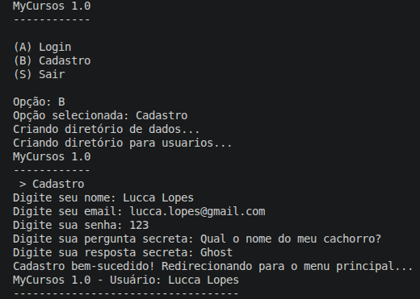
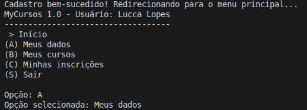
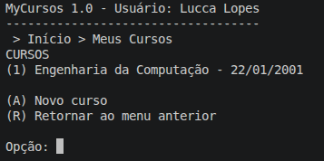
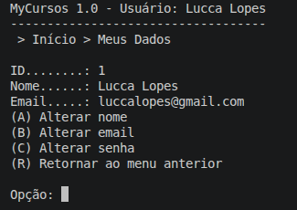
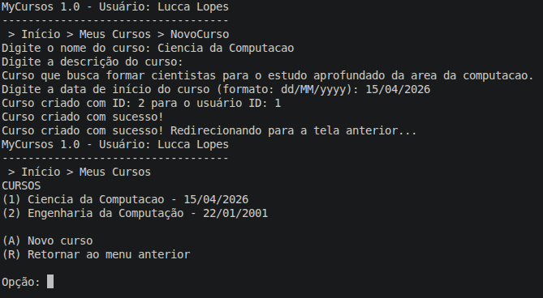

# MyCursos — TP1 · AEDS III · Grupo 02 · PUC Minas 2026

## Participantes

| Nome | Código de Pessoa |
|---|---|
| Daniel Santos | 1598779 |
| Daniel Rocha | 1543499 |
| Lucca Lopes | 642298 |
| Rafael Henrique Silva | 1543739 |

## Professor

Prof. Dr. Marcos André Silveira Kutova

---


## Descrição do Sistema

O **MyCursos** é um sistema de gestão de inscrições em cursos livres desenvolvido como Trabalho Prático 1 da disciplina **Algoritmos e Estruturas de Dados III (AEDS III)** do curso de Ciência da Computação da PUC Minas. Neste TP1, implementamos o cadastro e gerenciamento de **usuários** e **cursos**, com autenticação por email/senha, relacionamento 1:N entre usuários e cursos e gerenciamento completo de estados de curso.

O sistema roda em modo texto (terminal) e se baseia no padrão **MVC**, com separação entre entidades de dados (`Entidades`), operações de persistência (`CRUD`), menus de interface (`Menus`) e lógica de negócio (`Controles`). A navegação usa uma pilha de menus com **breadcrumb** automático exibido em cada tela.

---

## Telas do Sistema

### Tela de Autenticação



### Tela da Home



### Tela de Meus Cursos



### Tela de Meus Dados



### Tela de Novo Curso



---

## Vídeo de Demonstração

[VideoTrabalhoPraticoI_AEDsIII_Grupo02.mkv](Videos/VideoTrabalhoPraticoI_AEDsIII_Grupo02.mkv)

---

## Arquitetura e Classes Criadas

```
pucminas-cc-2026-ti3-g02-tp1/
├── Main.java
├── Entidades/
│   ├── Usuario.java                             # Entidade Usuário
│   ├── Curso.java                               # Entidade Curso
│   └── EstadoCurso.java                         # Enum de estados do curso
├── CRUD/
│   ├── CrudUsuario.java                         # CRUD de usuários (índice hash de email)
│   └── CrudCurso.java                           # CRUD de cursos (hash de código + 2 Árvores B+)
├── Genericos/
│   ├── Arquivo.java                             # Base genérica de arquivo binário (ArquivoIndexado)
│   ├── HashExtensivel.java                      # Tabela Hash Extensível genérica
│   ├── ArvoreBMais.java                         # Árvore B+ genérica
│   ├── Registro.java                            # Interface para entidades serializáveis
│   ├── RegistroHashExtensivel.java              # Interface para registros de hash
│   ├── RegistroArvoreBMais.java                 # Interface para registros de árvore B+
│   ├── ParIDEndereco.java                       # Par (id → endereço) — índice direto
│   ├── ParEmailID.java                          # Par (email → id) — índice de email
│   ├── ParCodigoID.java                         # Par (código → id) — índice de código NanoID
│   ├── ParIdUsuarioIdCurso.java                 # Par (idUsuario, idCurso) — relacionamento 1:N
│   └── ParUsuarioNomeCursoId.java               # Par (idUsuario, nome, idCurso) — ordenação
└── InterfaceGrafica/
    ├── Menus/
    │   ├── IMenu.java                           # Interface de menu
    │   ├── GerenciadorDeMenus.java              # Pilha de menus + breadcrumb + sessão do usuário
    │   ├── MenuUtils.java                       # Exibição e leitura de opções de menu
    │   ├── Home/
    │   │   └── MenuHome.java                    # Menu principal (Meus Dados / Meus Cursos / Sair)
    │   ├── Usuario/
    │   │   ├── MenuAuth.java                    # Tela inicial (Login / Cadastro / Sair)
    │   │   ├── MenuLogin.java                   # Formulário de login
    │   │   ├── MenuCadastro.java                # Formulário de cadastro
    │   │   ├── MenuMeusDados.java               # Perfil do usuário
    │   │   ├── MenuMeusCursos.java              # Listagem de cursos do usuário
    │   │   └── MenuMinhasInscricoes.java        # Inscrições (reservado para TP2)
    │   └── Curso/
    │       ├── MenuCurso.java                   # Detalhes e ações sobre um curso
    │       ├── MenuNovoCurso.java               # Formulário de criação de curso
    │       ├── MenuAlterarCurso.java            # Formulário de edição de curso
    │       └── MenuGerenciarInscritos.java      # Gerenciar inscritos (reservado para TP2)
    ├── Controles/
    │   ├── Home/
    │   │   └── ControleHome.java               # Lógica do menu principal
    │   ├── Usuario/
    │   │   ├── ControleAuth.java               # Roteamento de autenticação
    │   │   ├── ControleLogin.java              # Validação de email e hash de senha
    │   │   ├── ControleCadastro.java           # Cadastro com validação de email único
    │   │   ├── ControleMeusDados.java          # Edição de perfil (nome, email, senha)
    │   │   ├── ControleMeusCursos.java         # Listagem e seleção de cursos
    │   │   └── ControleMinhasInscricoes.java   # Inscrições (reservado para TP2)
    │   └── Curso/
    │       ├── ControleCurso.java              # Ações sobre curso (estado + navegação)
    │       ├── ControleNovoCurso.java          # Criação de curso
    │       └── ControleAlterarCurso.java       # Edição de nome, descrição e data
    └── Opcoes/
        ├── IOpcaoMenu.java
        ├── Home/OpcaoHome.java
        ├── Usuario/
        │   ├── OpcaoAuth.java
        │   ├── OpcaoMeusCursos.java
        │   ├── OpcaoMeusDados.java
        │   └── OpcaoMinhasInscricoes.java
        └── Curso/
            ├── OpcaoCurso.java
            ├── OpcaoAlterarCurso.java
            └── OpcaoGerenciarInscritos.java
```

---

## Detalhamento das Entidades

### Usuário (`Usuario.java`)

| Atributo | Tipo | Descrição |
|---|---|---|
| `id` | `int` | Identificador sequencial único (gerado automaticamente) |
| `nome` | `String` | Nome completo |
| `email` | `String` | Usado como login; pode ser alterado (ID não muda) |
| `hashSenha` | `String` | `String.valueOf(senha.hashCode())` |
| `perguntaSecreta` | `String` | Pergunta para recuperação de senha |
| `respostaSecreta` | `String` | Resposta à pergunta secreta |

### Curso (`Curso.java`)

| Atributo | Tipo | Descrição |
|---|---|---|
| `idCurso` | `int` | Identificador sequencial único |
| `idUsuario` | `int` | Chave estrangeira — ID do usuário dono do curso |
| `nome` | `String` | Nome do curso |
| `codigo` | `String` (10 chars) | Código NanoID gerado automaticamente na criação |
| `descricao` | `String` | Descrição detalhada |
| `dataInicio` | `Date` | Data de início prevista |
| `estado` | `char` | Estado atual (ver tabela abaixo) |

### Estados do Curso (`EstadoCurso.java`)

| Valor | Constante | Descrição |
|---|---|---|
| `'0'` | `ATIVO_INSCRICOES` | Ativo e recebendo inscrições |
| `'1'` | `ATIVO_SEM_INSCRICOES` | Ativo, mas sem novas inscrições |
| `'2'` | `CONCLUIDO` | Realizado e concluído |
| `'3'` | `CANCELADO` | Cancelado |

---

## Operações Implementadas

### Autenticação

- **Login**: o usuário informa email e senha. O sistema localiza o registro via `HashExtensivel` (índice de email), calcula `String.valueOf(senha.hashCode())` e compara com o `hashSenha` armazenado. Se conferir, o usuário fica em sessão no `GerenciadorDeMenus`.
- **Cadastro**: preenche nome, email, senha, pergunta e resposta secreta. O sistema valida que o email ainda não existe antes de criar o registro. Após o cadastro, o usuário já fica logado.

### Gerenciamento de Usuários

- **Visualizar dados**: exibe nome, email e pergunta secreta (sem expor senha).
- **Alterar nome**: atualiza o registro no arquivo e no índice direto.
- **Alterar email**: remove o par antigo do índice hash de email e insere o novo antes de gravar.
- **Alterar senha**: exige resposta correta à pergunta secreta; a nova senha é armazenada como hash.

### Gerenciamento de Cursos

- **Listar cursos**: percorre a `ArvoreBMais<ParUsuarioNomeCursoId>` por prefixo (`idUsuario`) e retorna os cursos já em ordem alfabética. O número exibido no menu é sequencial (1, 2, 3…), independente do ID interno.
- **Criar novo curso**: o usuário informa nome, descrição e data de início (formato `dd/MM/yyyy`). O sistema gera automaticamente o código NanoID de 10 caracteres, define o estado inicial como `'0'` (aberto) e associa o `idUsuario` do usuário logado. Ao gravar, os três índices de cursos são atualizados.
- **Visualizar curso**: exibe código, nome, estado (com descrição textual via `EstadoCurso`), data de início e descrição.
- **Editar curso** (`MenuAlterarCurso` / `ControleAlterarCurso`): permite alterar nome, descrição e data de início. Cada alteração chama `CrudCurso.update()`, que sincroniza todos os índices afetados (inclusive a Árvore B+ de nomes, se o nome mudar).
- **Encerrar inscrições**: exige confirmação, define estado `'1'` e atualiza via `CrudCurso.update()`.
- **Concluir curso**: exige confirmação, define estado `'2'` e atualiza.
- **Cancelar curso**: exibe aviso "Esta ação não pode ser desfeita!", exige confirmação e define estado `'3'`.
- **Gerenciar inscritos**: exibe "EM BREVE." — reservado para o TP2.

---

## Persistência de Dados e Estruturas de Dados

### `Arquivo<T>` — base de todos os CRUDs

Gerencia um `RandomAccessFile` com a seguinte estrutura de registro:

```
[ lápide (1 byte) ][ tamanho (2 bytes / short) ][ vetor de bytes (variável) ]
```

- Lápide `' '` = válido; `'*'` = excluído (exclusão lógica).
- Cabeçalho: último ID (4 bytes) + ponteiro para lista de espaços excluídos (8 bytes).
- Registros excluídos entram em lista encadeada ordenada por tamanho, permitindo reuso.
- **Índice direto**: `HashExtensivel<ParIDEndereco>` garante acesso O(1) por ID.

### Índices de Usuários (`CrudUsuario`)

| Índice | Estrutura | Mapeamento |
|---|---|---|
| Direto | `HashExtensivel<ParIDEndereco>` | id → endereço físico |
| Indireto de email | `HashExtensivel<ParEmailID>` | hash(email) → id |

### Índices de Cursos (`CrudCurso`)

| Índice | Estrutura | Mapeamento |
|---|---|---|
| Direto | `HashExtensivel<ParIDEndereco>` | idCurso → endereço físico |
| Indireto de código | `HashExtensivel<ParCodigoID>` | hash(código) → idCurso |
| Relacionamento 1:N | `ArvoreBMais<ParIdUsuarioIdCurso>` | (idUsuario, idCurso) |
| Ordenação por nome | `ArvoreBMais<ParUsuarioNomeCursoId>` | (idUsuario, nome, idCurso) |

### Arquivos em Disco

```
dados/
├── usuarios/
│   ├── usuarios.db           # Registros binários
│   ├── usuarios.d.db / .c.db # Índice direto (hash)
│   ├── indiceEmail.d.db      # Índice de email (diretório)
│   └── indiceEmail.c.db      # Índice de email (cestos)
└── cursos/
    ├── cursos.db              # Registros binários
    ├── cursos.d.db / .c.db   # Índice direto (hash)
    ├── indiceCodigo.d.db / .c.db   # Índice de código NanoID
    ├── arvoreUsuarioCurso.d.db     # Árvore B+ — relação 1:N
    └── arvoreUsuarioNome.d.db      # Árvore B+ — ordenação por nome
```

---

## Como Compilar e Executar

**Pré-requisitos:** Java 11+ e Maven instalados.

Os diretórios e arquivos de dados são criados automaticamente na primeira execução.

### Opção 1 — Compilar e executar em um só comando

```bash
mvn clean compile exec:java
```

### Opção 2 — Compilar e executar separadamente

```bash
mvn clean compile
mvn exec:java -Dexec.mainClass="Main"
```

### Opção 3 — Gerar `.jar` e executar

```bash
mvn clean package
java -jar target/pucminas-cc-2026-ti3-g02-tp1-1.0.0.jar
```

---

## Checklist


**1. Há um CRUD de usuários (que estende a classe ArquivoIndexado, acrescentando Tabelas Hash Extensíveis e Árvores B+ como índices diretos e indiretos conforme necessidade) que funciona corretamente?**

**Sim.** 

**2. Há um CRUD de cursos (que estende a classe ArquivoIndexado, acrescentando Tabelas Hash Extensíveis e Árvores B+ como índices diretos e indiretos conforme necessidade) que funciona corretamente?**

**Sim.** 

**3. Os cursos estão vinculados aos usuários usando o idUsuario como chave estrangeira?**

**Sim.** 

**4. Há uma árvore B+ que registre o relacionamento 1:N entre usuários e cursos?**

**Sim.** 

**5. Há um CRUD de usuários (que estende a classe ArquivoIndexado, acrescentando Tabelas Hash Extensíveis e Árvores B+ como índices diretos e indiretos conforme necessidade)?**

**Sim.** 

**6. O trabalho compila corretamente?**

**Sim.** `mvn clean compile` conclui sem erros. A única dependência externa é `jnanoid-enhanced` (via JitPack), declarada no `pom.xml`.

**7. O trabalho está completo e funcionando sem erros de execução?**

**Sim, com ressalvas.** Autenticação, cadastro, gerenciamento de dados do usuário, criação e listagem de cursos, edição de dados do curso e todas as mudanças de estado (encerrar inscrições, concluir, cancelar) estão implementados. A opção "Gerenciar inscritos" exibe "EM BREVE." (conforme especificado, essa funcionalidade fica para o TP2). A verificação que impede excluir um usuário com cursos ativos vinculados, bem como a lógica que exclui ou cancela um curso com base na existência de inscritos, não foram implementadas (dependem do sistema de inscrições do TP2).

**8. O trabalho é original e não a cópia de um trabalho de outro grupo?**

**Sim.**

---

## Tecnologias Utilizadas

- **Linguagem:** Java 11
- **Build:** Maven
- **Dependência:** `jnanoid-enhanced` (geração de código NanoID de 10 caracteres)
- **Persistência:** `RandomAccessFile` com serialização binária via `DataOutputStream` / `DataInputStream`
- **Estruturas de dados customizadas:** `HashExtensivel` e `ArvoreBMais`
